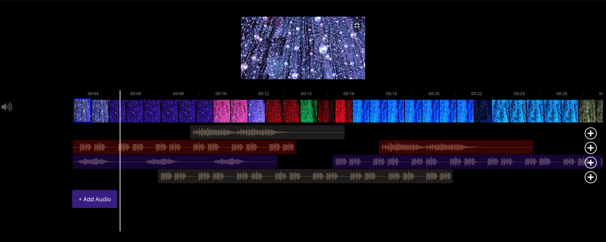

# Multi-Track Video Editor

A web-based multi-track video editor built with **React** and **Wavesurfer.js**. This project allows users to upload videos and multiple audio tracks, arrange audio in the timeline, and sync them seamlessly for a fully customized video editing experience.

---

## Features

- **Upload Videos and Audios**:
  - Add a video file to the editor.
  - Add multiple audio tracks to the timeline.

- **Drag and Drop Functionality**:
  - Drag audio waveforms in the timeline to adjust their positions.
  - Move audio tracks up and down within the timeline.

- **Waveform Visualization**:
  - Visualize audio tracks with draggable waveforms powered by Wavesurfer.js.
  - Real-time synchronization with the video playback.

- **Timeline and Playback**:
  - Play, pause, and navigate the timeline using a seek bar.
  - Timestamps for precise positioning of audio and video.

- **Customizable Layout**:
  - Dynamic resizing of tracks and responsive UI for seamless editing.

---

## Technologies Used

- **Frontend**: React.js
- **Waveform Handling**: Wavesurfer.js
- **State Management**: React Hooks


---

## Getting Started

Follow these steps to set up and run the project locally.

### Prerequisites

Ensure you have the following installed:

- **Node.js** (v14 or above)
- **npm** or **yarn**

### Installation

1. Clone the repository:
   ```bash
   git clone https://github.com/Maman08/videoEditor.git
   cd videoEditor

2. Install dependencies:
   ```bash
   npm install

3. Start the development server:
   ```bash
   npm start   

